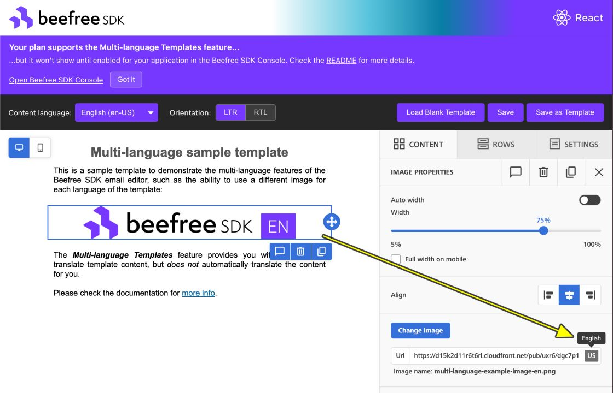

# 🌐 Multi-language Template Example

A focused example that demonstrates **multi-lingual email templates** with the Beefree SDK: a single **Email Builder**, an **LTR/RTL language collection** toggle, and a **content language** dropdown. This example is part of the **@beefree.io/react-email-builder** wrapper examples in this repo. Built with [@beefree.io/react-email-builder](https://www.npmjs.com/package/@beefree.io/react-email-builder), React 19, TypeScript, and Vite. Backend auth runs on **port 3021**, frontend on **8921**. (frontend uses **8921** instead of 8021 to avoid conflicts with other commonly found applications that use that port.)

---

## Features

- **Email Builder only** – Single builder type, one credential set (`BEEFREE_CLIENT_ID` / `BEEFREE_CLIENT_SECRET`).
- **LTR/RTL language collections** – Toggle between two sets of 10 languages each. **LTR:** English, 普通话, हिन्दी, Español, Français, বাংলা, Napulitano, Català, Euskara, Galego. **RTL:** فارسی, 日本語, العربية, Türkçe, ދިވެހި, اردو, پښتو, سنڌي, ئۇيغۇرچە, سۆرانی. The dropdown shows each language in its native name. Switching from LTR to RTL (or vice versa) loads the matching template for the current mode (sample or blank). See [Supported plan behavior](#supported-plan-behavior) for how the Superpowers and Enterprise plans differ.
- **Plan-aware language guard** – Languages beyond the SDK's 1 main language + 6 translations Superpowers limit are marked with dashes in the dropdown (e.g. `--Català--`) and show an upgrade prompt if selected. Enterprise users see all labels clean and all languages accessible. If you wish to modify the example adding more languages to the list, bear in mind that 1 main language + 20 translations limit applies to Enterprise plans (at the time of writing).
- **Contextual MLT banners** – The UI shows a warning banner when the detected plan does not satisfy MLT requirements, and an informational tip banner when the plan supports MLT but the feature may still need to be enabled at application level. Both banners include a Console link and a dismiss action.
- **Hidden native menu bar** – While the builder may render its native menu bar, most customers prefer to implement their own (as in the present example). The native menu bar can be hidden through the server-side toolbar options (most common and flexible way to do so), or by setting `topBarEnabled: false` in the clientConfig (see BuilderPanel.tsx).
- **Secure auth** – Credentials stay on the server; frontend receives a short-lived token.
- **Template mode toggle + core actions** – The first button toggles between **Load Blank Template** and **Load Sample Template**, then the builder loads the matching LTR/RTL version. Blank mode includes an RTL-specific blank template with Noto Sans Arabic defaults. Save and Save as Template are available via `useBuilder()`.

---

## Quick Start

### Prerequisites

- Node.js 22+ and Yarn
- Beefree SDK credentials from the [Developer Console](https://developers.beefree.io)

### Before launch &nbsp; 🚀

Create `./multi-language-template-example/.env` (or copy and replace the contents of .env.example):

```
cp ./multi-language-template-example/.env.example ./multi-language-template-example/.env
```

```env
BEEFREE_CLIENT_ID=your_client_id_here
BEEFREE_CLIENT_SECRET=your_client_secret_here
PORT=3021
VITE_PORT=8921
```

### Run from repository root

```bash
yarn start:multi-language
```

Then open http://localhost:8921.

### Run from this folder

```bash
cd multi-language-template-example
yarn install
yarn start
```

Then open http://localhost:8921.


---


## Authentication

The frontend calls the local backend `/auth/token` with `{ uid }`. The backend uses `BEEFREE_CLIENT_ID` and `BEEFREE_CLIENT_SECRET` to obtain a token from Beefree and returns it to the client. Credentials are never sent to the browser.

```
Frontend                    Backend (server.ts)           Beefree API
   |                                |                            |
   |  POST /auth/token { uid }   -> |                            |
   |                                |  POST /loginV2 { ... }  -> |
   |                                | <- token                   |
   | <- token                       |                            |
   |  <Builder token={token} />     |                            |
```

Backend: http://localhost:3021  
Frontend: http://localhost:8921

---

## Environment variables

| Variable | Required | Default | Description |
|----------|----------|--------|-------------|
| `BEEFREE_CLIENT_ID` | Yes | - | Beefree Client ID |
| `BEEFREE_CLIENT_SECRET` | Yes | - | Beefree Client Secret |
| `PORT` | No | `3021` | Backend server port |
| `VITE_PORT` | No | `8921` | Frontend dev server port (8921 used to avoid conflicts with 8021) |
| `VITE_BEEFREE_AUTH_PROXY_URL` | No | `/auth/token` | Auth endpoint (e.g. use `http://localhost:3000/auth/token` for shared secure-auth-example) |

---

## Scripts

```bash
yarn build            # Production build
yarn dev              # Frontend only (port 8921)
yarn server:dev       # Backend only (port 3021)
yarn start            # Backend + Frontend
yarn test             # Run tests
yarn test:coverage    # Run tests with coverage
yarn type-check       # TypeScript check
...
```

---

## Plan detection

- After authentication, the frontend decodes the JWT payload and reads the `plan` field.
- It is then mapped to the current canonical plans: `Free`, `Essentials`, `Core`, `Superpowers`, or `Enterprise`. If the plan cannot be determined, it is treated as `Unknown`.
- Multi-language Templates require a **Superpowers** or **Enterprise** plan (See [Supported plan behavior](#supported-plan-behavior) for more details).
- If the detected plan is below Superpowers, a warning banner is shown and the interface remains blocked to avoid unsupported interactions. If the plan wasn't recognized (`Unknown`) it displays a developer-facing message indicating the issue.
- The warning banner is dismissible, but dismissing it only hides the banner. The interface remains blocked and the blank template remains enforced until valid credentials/plan are used.
- When the plan supports MLT, an informational tip banner is shown with guidance about enabling MLT at application level in the [Beefree SDK Console](https://developers.beefree.io/console). This tip is also dismissible.

## Supported plan behavior

The Beefree SDK enforces a language limit internally, regardless of how many languages are registered in the builder configuration. This example intentionally exposes more languages than the Superpowers limit to demonstrate Enterprise-only languages alongside the standard ones.

| Feature | Superpowers | Enterprise |
|---------|-------------|------------|
| Template languages | Up to 7 (1 main + 6 translations) | Up to 21 (1 main + 20 translations) |
| LTR collection languages accessible | 7 of 10 | All 10 |
| RTL collection languages accessible | 7 of 10 | All 10 |
| Restricted language indicator in dropdown | `--Name--` decoration | None (all labels clean) |
| Selecting a restricted language | Shows upgrade prompt | Works normally |
| Bidirectional language sync | Yes | Yes |

### Superpowers plan

The content language dropdown shows all 10 languages in each collection, but languages beyond position 7 are decorated with dashes (e.g. `--Català--`, `--سنڌي--`). Selecting one of these shows an alert explaining that an Enterprise plan is required and linking to the [MLT documentation](https://docs.beefree.io/beefree-sdk/other-customizations/multi-language-templates); the selection reverts to the last valid language.

### Enterprise plan

All 10 languages in each collection are fully accessible. Language labels appear without any decoration. 

### Developer note: hiding unavailable languages

The code includes an easy way to hide the restricted languages instead of singling them out (just set `SHOULD_HIDE_EXCEEDING_LANGUAGES` to `true` in MultiLanguageExample.tsx), if you prefer a cleaner UX where only the reachable languages are shown.

---

## Multi-language Templates (MLT) feature warning ⚠️

Both Superpowers and Enterprise plans include the MLT feature, but it is not enabled by default. The builder will load just the same, but some MLT elements might **silently fail**. While this example decodes the JWT access token to detect what plan corresponds to the credentials provided (and sets the eventual language limits to its own interface), it is the Beefree SDK builder that checks whether the MLT feature is enabled or disabled for the user, under the hood.

In supported plans, the example shows a dismissible informational tip banner that reminds you to enable MLT at application level.

To quickly confirm that the feature is enabled in your application:

- Select the image in the example design (the Beefree SDK logo with the language code)
- Check the image url input field in the CONTENT tab. It should display an icon with the language region that displays a tooltip with the language name when hovering over it:<br><br>


---

## Troubleshooting

- **Authentication fails** – Ensure the backend is running on 3021 and `.env` has valid `BEEFREE_CLIENT_ID` and `BEEFREE_CLIENT_SECRET`.
- **Using shared auth** – Start `secure-auth-example` (port 3000), set `VITE_BEEFREE_AUTH_PROXY_URL=http://localhost:3000/auth/token` in `.env`, and run only `yarn dev` here.
- **Builder not loading** – Check the browser console and that the token request returns 200.
- **Port 8921 (or 3021) already in use** – The dev server is configured with `strictPort: true`, so it will exit if 8921 is taken. Stop any other process using that port (e.g. another instance of this example, or run `lsof -i :8921` / `lsof -i :3021` to find it) and try again.
- **MLT is not working** – If you see "Multi-language Templates may not be enabled", either your plan is below Superpowers or the MLT capability is not enabled for your application in the SDK Console. Verify your plan and application capabilities in [Developer Console](https://developers.beefree.io/console).

---

## Related

- [@beefree.io/react-email-builder](https://www.npmjs.com/package/@beefree.io/react-email-builder)
- [Beefree SDK docs](https://docs.beefree.io/beefree-sdk/)
- [Developer Console](https://developers.beefree.io)
