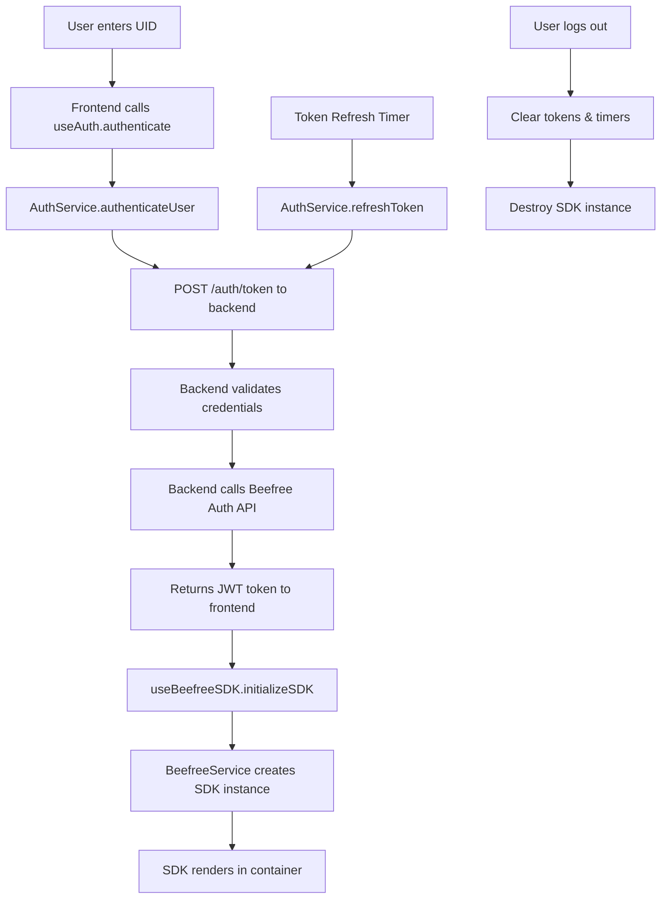

# 🔐 Secure Auth Example - Production-Ready Authentication

This example demonstrates **secure, production-ready authentication** for the Beefree SDK using a modern **React + TypeScript** architecture. It showcases best practices for handling authentication tokens, automatic token refresh, and secure credential management.

## ✨ Key Features

### 🔐 **Enterprise-Grade Security**
- **Backend-Only Credentials**: Client ID/Secret never exposed to frontend
- **Secure Token Management**: JWT tokens with automatic refresh
- **Shared Authentication Module**: Reusable auth logic across examples
- **Production-Ready Error Handling**: Comprehensive error states and recovery

### 🏗️ **Modern Architecture**
- **React 18 + TypeScript**: Type-safe component architecture
- **Vite**: Lightning-fast development server and build system
- **Custom Hooks**: `useAuth` and `useBeefreeSDK` for state management
- **Service Layer**: Clean separation of authentication and SDK logic
- **Concurrent Development**: Frontend and backend run simultaneously

### 🔄 **Advanced Authentication Flow**
- **Automatic Token Refresh**: Tokens refresh every 5 minutes automatically
- **State Management**: Comprehensive auth state with loading indicators
- **Error Recovery**: Graceful handling of auth failures
- **Session Persistence**: Maintains auth state during development

## 🏗️ Architecture Overview

### **Project Structure**
```
secure-auth-example/
├── src/
│   ├── components/           # React components
│   │   ├── App.tsx          # Main application with auth flow
│   │   ├── Header.tsx       # Header with auth status
│   │   ├── AuthForm.tsx     # Authentication form
│   │   └── BeefreeEditor.tsx # SDK editor wrapper
│   ├── hooks/
│   │   ├── useAuth.ts       # Authentication state management
│   │   └── useBeefreeSDK.ts # SDK lifecycle management
│   ├── services/
│   │   ├── authService.ts   # Authentication API calls
│   │   └── beefreeService.ts # Beefree SDK integration
│   ├── config/
│   │   └── constants.ts     # Application constants
│   ├── types/
│   │   └── index.d.ts       # TypeScript type definitions
│   └── styles.css           # Global application styles
├── server.js                # Express.js backend server
├── vite.config.ts           # Vite configuration
├── tsconfig.json           # TypeScript configuration
└── package.json            # Dependencies and scripts
```

### **Authentication Flow Architecture**



### **Core Components**

#### **🎯 App.tsx** - Main Application Flow
```typescript
export const App = () => {
  const auth = useAuth()

  return (
    <div className="container">
      <Header authState={auth} onLogout={auth.logout} />
      
      {!auth.isAuthenticated ? (
        <AuthForm 
          authState={auth} 
          onAuthenticate={auth.authenticate}
        />
      ) : (
        <BeefreeEditor authState={auth} />
      )}
    </div>
  )
}
```

#### **🔐 useAuth Hook** - Authentication State Management
```typescript
export const useAuth = () => {
  const [authState, setAuthState] = useState<AuthState>({
    isAuthenticated: false,
    isAuthenticating: false
  })

  const authenticate = useCallback(async (uid: string) => {
    setAuthState(prev => ({ ...prev, isAuthenticating: true }))
    
    try {
      const token = await authService.authenticateUser(uid)
      setAuthState({
        isAuthenticated: true,
        isAuthenticating: false,
        uid, token
      })
      
      // Setup automatic token refresh
      authService.setupTokenRefresh(uid, (newToken) => {
        setAuthState(prev => ({ ...prev, token: newToken }))
      })
    } catch (error) {
      setAuthState(prev => ({
        ...prev,
        isAuthenticating: false,
        error: error.message
      }))
    }
  }, [])

  return { ...authState, authenticate, logout }
}
```

#### **🔧 AuthService** - Authentication API Layer
```typescript
export class AuthService {
  private tokenRefreshTimer: ReturnType<typeof setInterval> | null = null

  async authenticateUser(uid: string): Promise<AuthToken> {
    const response = await fetch('/auth/token', {
      method: 'POST',
      headers: { 'Content-Type': 'application/json' },
      body: JSON.stringify({ uid })
    })

    if (!response.ok) {
      throw new Error(`Authentication failed: ${response.status}`)
    }

    return await response.json()
  }

  setupTokenRefresh(uid: string, onTokenRefresh: (token: AuthToken) => void) {
    this.clearTokenRefresh()
    
    this.tokenRefreshTimer = setInterval(async () => {
      try {
        const newToken = await this.refreshToken(uid)
        onTokenRefresh(newToken)
      } catch (error) {
        console.error('❌ Token refresh failed:', error)
      }
    }, 300000) // 5 minutes
  }
}
```

#### **🚀 BeefreeService** - SDK Integration
```typescript
export class BeefreeService {
  private beeInstance: any = null

  async initializeSDK(_token: AuthToken, uid: string): Promise<any> {
    // Load template
    const templateData = await this.loadTemplate()
    
    // Get proper IToken from backend
    const authResponse = await fetch('/auth/token', {
      method: 'POST',
      headers: { 'Content-Type': 'application/json' },
      body: JSON.stringify({ uid })
    })
    
    const properToken = await authResponse.json()
    
    // Initialize SDK with proper token
    this.beeInstance = new BeefreeSDK(properToken)
    
    const clientConfig = {
      container: 'bee-plugin-container',
      uid: uid,
    }
    
    window.bee = this.beeInstance
    this.beeInstance.start(clientConfig, templateData)
    
    return this.beeInstance
  }
}
```

### **Backend Server Architecture**

#### **🛡️ Express.js Server** - Secure Backend
```javascript
import express from 'express'
import { setupAuthEndpoint } from '../shared/auth.js'

const app = express()

// Setup shared authentication endpoint
setupAuthEndpoint(app, process.env.BEEFREE_CLIENT_ID, process.env.BEEFREE_CLIENT_SECRET)

// Health check endpoint
app.get('/health', (req, res) => {
  res.json({ status: 'healthy', timestamp: new Date().toISOString() })
})
```

#### **🔒 Shared Authentication Module** - `../shared/auth.js`
The backend uses a shared authentication module that:
- Handles Beefree SDK authentication
- Manages token generation and validation
- Provides consistent error handling
- Implements security best practices

## 🚀 Quick Start

### **Prerequisites**
- Node.js 16+
- Beefree SDK credentials (Client ID + Secret)

### **Installation**
```bash
# Clone and navigate
cd secure-auth-example

# Install dependencies
yarn install

# Configure environment
cp .env.example .env
# Edit .env with your Beefree SDK credentials
```

### **Environment Configuration**
Create `.env` file:
```env
# Beefree SDK Credentials (Backend Only)
BEEFREE_CLIENT_ID=your_client_id_here
BEEFREE_CLIENT_SECRET=your_client_secret_here

# Server Configuration
PORT=3000
NODE_ENV=development

# Frontend Configuration (Vite)
VITE_PORT=8080
```

**🚨 Security Note**: Client ID and Secret are only used on the backend server, never exposed to the frontend.

### **Development**
```bash
# Start both frontend and backend
yarn dev

# Or start individually:
yarn server  # Backend only (port 3000)
yarn client  # Frontend only (port 8080)

# Build for production
yarn build

# Type checking
yarn type-check
```

### **Open in browser**
- **Frontend**: http://localhost:8080
- **Backend API**: http://localhost:3000

## 🎯 Usage Guide

### **Authentication Flow**
1. **Start the application**: Open http://localhost:8080
2. **Enter User ID**: Use any unique identifier (e.g., "demo-user-123")
3. **Authenticate**: Click "Authenticate & Load Editor"
4. **Editor loads**: Beefree SDK initializes with secure token
5. **Auto-refresh**: Tokens refresh automatically every 5 minutes

### **Testing Authentication**
```bash
# Test backend auth endpoint directly
curl -X POST http://localhost:3000/auth/token \
  -H "Content-Type: application/json" \
  -d '{"uid": "test-user"}'

# Expected response:
{
  "access_token": "jwt_token_here",
  "authUrl": "https://auth.beefree.io",
  "authToken": "auth_token_here",
  // ... other token properties
}
```

### **Health Check**
```bash
curl http://localhost:3000/health

# Response:
{
  "status": "healthy",
  "timestamp": "2024-01-01T12:00:00.000Z"
}
```

## 🔧 Technical Implementation

### **React + TypeScript Architecture**

#### **Type Safety**
```typescript
export interface AuthToken {
  access_token: string
  v2?: boolean
}

export interface AuthState {
  isAuthenticated: boolean
  isAuthenticating: boolean
  uid?: string
  token?: AuthToken
  error?: string
}

export interface BeefreeInstance {
  save(): Promise<any>
  load(template: any): Promise<any>
  start(): Promise<any>
  destroy(): Promise<any>
}
```

#### **Custom Hook Patterns**
- **useAuth**: Manages authentication state and lifecycle
- **useBeefreeSDK**: Handles SDK initialization and cleanup
- **Service Layer**: Separates API calls from React components

#### **Error Handling**
```typescript
// Comprehensive error states
if (error) {
  return (
    <div className="editor-container">
      <div className="error-message">
        ❌ Failed to initialize Beefree SDK: {error}
      </div>
    </div>
  )
}
```

### **Security Implementation**

#### **🛡️ Backend Security**
- **Credentials Isolation**: Client ID/Secret only on server
- **CORS Configuration**: Proper cross-origin request handling
- **Input Validation**: All requests validated and sanitized
- **Error Handling**: No sensitive information in error responses

#### **🔐 Frontend Security**
- **No Credential Exposure**: Zero sensitive data in frontend code
- **Token Management**: Secure token storage and refresh
- **Type Safety**: TypeScript prevents runtime security issues

#### **🔄 Token Management**
- **Automatic Refresh**: Tokens refresh before expiration
- **Graceful Degradation**: Handles refresh failures gracefully
- **Memory Management**: Proper cleanup on logout/unmount

### **Development Features**

#### **🔥 Hot Reloading**
- **Vite HMR**: Instant updates during development
- **State Preservation**: Auth state maintained during hot reloads
- **TypeScript Integration**: Real-time type checking

#### **🧪 Development Tools**
- **Concurrent Servers**: Frontend and backend run together
- **Environment Validation**: Startup checks for required variables
- **Comprehensive Logging**: Detailed logs for debugging

## 🎨 Customization Guide

### **UI Customization**
Modify components in `src/components/` to customize:
- Authentication form layout and styling
- Header design and branding
- Error message presentation
- Loading states and animations

### **Authentication Logic**
Extend `AuthService` to add:
- Custom token validation
- Additional auth providers
- Enhanced error handling
- Custom refresh strategies

### **SDK Configuration**
Modify `BeefreeService` to customize:
- Template loading logic
- SDK initialization parameters
- Container management
- Event handling

## 🧪 Testing

### **Manual Testing Checklist**
- [ ] Authentication with valid UID works
- [ ] Authentication with invalid UID fails gracefully
- [ ] Token refresh works automatically
- [ ] Logout clears all state and timers
- [ ] SDK initializes correctly after auth
- [ ] Error states display properly
- [ ] Loading states work correctly

### **API Testing**
```bash
# Test authentication endpoint
curl -X POST http://localhost:3000/auth/token \
  -H "Content-Type: application/json" \
  -d '{"uid": "test-user"}'

# Test health endpoint
curl http://localhost:3000/health
```

### **Frontend Testing**
```bash
# Type checking
yarn type-check

# Build test
yarn build

# Development server test
yarn dev
```

## 🚀 Production Deployment

### **Environment Variables**
```env
# Production environment
NODE_ENV=production
PORT=3000

# Beefree SDK Credentials
BEEFREE_CLIENT_ID=your_production_client_id
BEEFREE_CLIENT_SECRET=your_production_client_secret

# Frontend build configuration
VITE_PORT=8080
```

### **Build Process**
```bash
# Build frontend
yarn build

# Start production server
yarn start

# Files served from dist/ directory
```

### **Security Considerations**
- **HTTPS Required**: Use HTTPS in production
- **Environment Variables**: Store credentials securely
- **CORS Configuration**: Restrict origins in production
- **Rate Limiting**: Implement request rate limiting
- **Logging**: Configure production logging

### **Performance Optimization**
- **Frontend**: Vite provides optimal bundling and tree-shaking
- **Backend**: Express.js with minimal middleware overhead
- **Token Caching**: Efficient token management
- **Resource Optimization**: Minified CSS and JavaScript

## 📚 Resources

- **[Beefree SDK Authentication Documentation](https://docs.beefree.io/beefree-sdk/authentication/)**
- **[JWT Token Best Practices](https://auth0.com/blog/a-look-at-the-latest-draft-for-jwt-bcp/)**
- **[React Security Best Practices](https://snyk.io/blog/10-react-security-best-practices/)**
- **[Express.js Security Guide](https://expressjs.com/en/advanced/best-practice-security.html)**

## 🤝 Contributing

When contributing to this example:
1. **Follow security best practices**
2. **Maintain TypeScript type safety**
3. **Test authentication flows thoroughly**
4. **Update documentation for changes**
5. **Ensure backward compatibility**
6. **Never commit credentials or tokens**

## 🔗 Integration with Other Examples

This example serves as the **authentication provider** for other examples:

- **custom-css-example**: Uses this server for auth proxy
- **template-export-pdf-example**: Shares authentication logic
- **Future examples**: Can leverage the shared auth module

### **Shared Authentication Module**
Located in `../shared/auth.js`, this module provides:
- Consistent authentication logic
- Token management utilities  
- Error handling patterns
- Security best practices

---

This example demonstrates enterprise-grade authentication implementation with modern development practices, comprehensive security measures, and production-ready architecture.